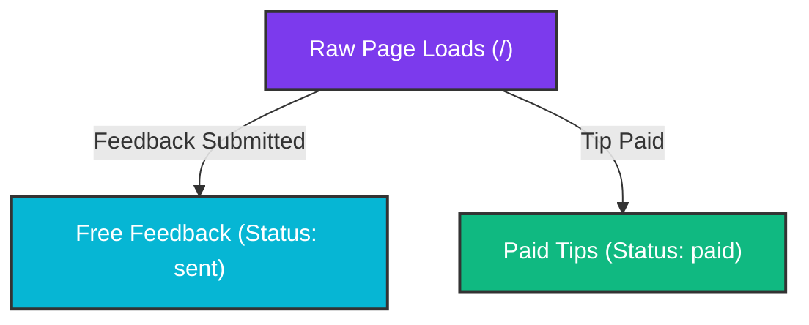

# Visitor Analytics & Conversion Funnel

## Problem Frame
Livestreamers want to understand the conversion behavior of their audience. Currently, the streamer knows how many feedback notes and tips they receive because they are saved in the database, but they do not know how many total viewers actually load the page. This makes it impossible to know the conversion rate (e.g. "What percentage of visitors leave free feedback vs. complete a tip?").

## Conversion Funnel Flow

## Requirements

**Tracking Page Views**
- **R1**: Track every raw page load (page view) on the main donor page (`/`).
- **R2**: Exclude non-donor routes (such as `/overlay` and `/admin`) from page view tracking.
- **R3**: Persist page views to a SQLite table named `page_views`.
- **R4**: Broadcast page view events in real-time via `Phoenix.PubSub` so that the admin page updates dynamically without requiring a page refresh.

**Admin Dashboard Funnel Section**
- **R5**: Implement a dedicated, visually premium "Conversion Funnel" card/section on the `/admin` page, positioned above the notes and tips stream.
- **R6**: The Conversion Funnel must display the following metrics:
  - **Total Views**: Total count of page views recorded.
  - **Feedback Conversion**: Total free feedback messages (`status == "sent"`) and the percentage relative to Total Views.
  - **Tip Conversion**: Total paid tips (`status == "paid"`) and the percentage relative to Total Views.
- **R7**: Ensure the funnel indicators adapt gracefully to zero division (e.g., if there are 0 page views, show 0.0% conversion instead of crashing) and cap conversion rates at 100.0% if page views are less than historical feedback or tip counts.
- **R8**: Design the visual layout of the funnel using CSS/HTML to look modern and premium, blending with the existing developer-terminal aesthetic (cyan, purple, glassmorphism).

## Success Criteria
- Opening the donor page `/` increments the page views table and broadcasts the event.
- Opening `/overlay` or `/admin` does not increment page views.
- The Admin Panel dynamically updates the page view count and conversion percentages in real-time.
- The layout is clean and matches the app's premium dark mode theme.

## Scope Boundaries
- **Exclusion**: No tracking of unique visitors (IP hashes, cookies, or sessions) as per the user's preference for simple raw page views.
- **Exclusion**: No tracking of referrers, device types, geolocations, or user agents.
- **Exclusion**: No third-party charting libraries (e.g., Chart.js) to keep assets small and local; use raw CSS/HTML bars or indicators.

## Key Decisions
- **Raw Page Views**: Simple page view increments on load, avoiding cookies/privacy disclosures.
- **SQLite Storage**: Avoid external services to maintain 100% data ownership and ease of deployment.

## Next Steps
→ `/ce:plan` for structured implementation planning.
