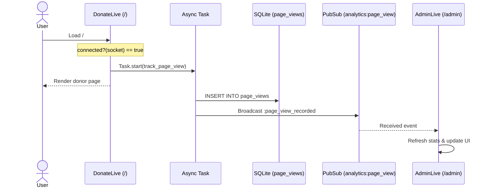

# feat: Add visitor tracking and admin conversion funnel

## Overview
We will implement raw page view tracking for the donor page (`/`) and render a real-time conversion funnel on the administrative panel (`/admin`). This will help the streamer see how many total visits they get compared to feedback submissions and tips paid.

## Problem Frame
Currently, the database records successful feedback submissions and tips, but does not capture raw visits to the donor page. The streamer lacks visibility into how well their stream audience is converting into feedback notes or tip supporters.

## Requirements Trace
- **R1**: Track every raw page load (page view) on the main donor page (`/`).
  - *Trace*: Satisfied by tracking in `DonateLive.mount/3` under the connected socket condition.
- **R2**: Exclude other routes (such as `/overlay` and `/admin`) from page view tracking.
  - *Trace*: Track only in the `DonateLive` mount function, leaving other routes untouched.
- **R3**: Persist page views to a SQLite table named `page_views`.
  - *Trace*: Satisfied by migration and `Notable.Analytics.PageView` schema.
- **R4**: Broadcast page view events in real-time via `Phoenix.PubSub`.
  - *Trace*: Broadcast on the `"analytics:page_view"` topic when a page view is recorded.
- **R5**: Implement a dedicated "Conversion Funnel" card/section on the `/admin` page above the notes/tips stream.
  - *Trace*: Render a styled funnel panel in `AdminLive.render/1` when `@filter` is active.
- **R6**: Show Total Views, Feedback count + %, Tip count + %.
  - *Trace*: Calculations performed in `Notable.Analytics.get_funnel_stats/0`.
- **R7**: Ensure the funnel indicators adapt gracefully to zero division and cap conversion rates at 100.0% if page views are fewer than feedback/tip counts (handling pre-existing data).
  - *Trace*: Handled in percentage formatting helper.
- **R8**: Design the visual layout of the funnel using CSS/HTML to match the developer-terminal dark theme (purple, cyan, glassmorphism).
  - *Trace*: UI styling using Tailwind 4 utility classes matching `/admin` and `/overlay` visual system.

## Scope Boundaries
- **Non-goal**: Unique visitor tracking (no IP hashing or cookies) as raw page views were explicitly chosen by the user.
- **Non-goal**: Geographic or browser metadata extraction.
- **Non-goal**: Third-party charting libraries (only pure CSS/HTML progress bars and stat cards).

## Context & Research

### Relevant Code and Patterns
- Schema creation pattern: [Donation Schema](file:///Users/riza/code/notable/lib/notable/donations/donation.ex) (uses `:binary_id` primary key, `timestamps(type: :utc_datetime)`).
- Migration pattern: [Add Reaction Migration](file:///Users/riza/code/notable/priv/repo/migrations/20260715121433_add_reaction_to_donations.exs).
- LiveView PubSub subscription and real-time updates: [AdminLive mount and handle_info](file:///Users/riza/code/notable/lib/notable_web/live/admin_live.ex).

## Key Technical Decisions
- **Connected Socket Tracking**: Track page views in `DonateLive` only when `connected?(socket)` is true. This naturally filters out simple bot scrapers, search crawlers, or ping utilities that do not execute JavaScript or open WebSocket connections.
- **Asynchronous Writes**: Run database insertions inside a `Task.start/1` block in the context layer. This ensures that DB write locks or latency in SQLite do not block or delay the page rendering response to the donor.

## Open Questions

### Resolved During Planning
- **Question**: Should we use IP-hashing for unique users?
  - *Resolution*: No, user opted for raw page views.
- **Question**: Where do we put the database queries?
  - *Resolution*: A new context `Notable.Analytics` will keep these queries isolated from the `Notable.Donations` context.

### Deferred to Implementation
- **Question**: Exact visual layout details of the progress bars in Tailwind 4.
  - *Resolution*: Styled inline during work to match the exact dark terminal colors (using standard Tailwind colors such as `violet` and `cyan`).

## High-Level Technical Design
> *This illustrates the intended approach and is directional guidance for review, not implementation specification. The implementing agent should treat it as context, not code to reproduce.*

## Implementation Units

- [x] **Unit 1: Database Migration and Ecto Schema**
  - **Goal**: Persist page view data in a dedicated table.
  - **Requirements**: R3
  - **Dependencies**: None
  - **Files**:
    - Create: `priv/repo/migrations/20260719183000_create_page_views.exs`
    - Create: `lib/notable/analytics/page_view.ex`
  - **Approach**:
    - Primary key: `id` `:binary_id`.
    - Column: `path` `:string` (non-null).
    - Uses standard `timestamps(type: :utc_datetime)`.
  - **Test scenarios**:
    - *Happy path*: PageView changeset validates path presence and inserts correctly.
  - **Verification**: Run migrations and ensure table schema is correctly defined.

- [x] **Unit 2: Analytics Context Module**
  - **Goal**: Implement write/read operations for analytics.
  - **Requirements**: R1, R3, R4, R6
  - **Dependencies**: Unit 1
  - **Files**:
    - Create: `lib/notable/analytics.ex`
  - **Approach**:
    - `track_page_view(path)`: Spawns an async `Task` to insert page view, then broadcasts `{:page_view_recorded, path}` on `"analytics:page_view"` topic.
    - `get_funnel_stats()`: Queries `page_views` total count, feedback count (sent notes), and paid tips count in SQLite.
  - **Test scenarios**:
    - *Happy path*: `track_page_view/1` correctly spawns task and inserts database row.
    - *Happy path*: `get_funnel_stats/0` accurately counts views, feedback, and tips.
  - **Verification**: Database queries return exact aggregates.

- [x] **Unit 3: Context & Integration Tests**
  - **Goal**: Ensure reliability and prevent regressions.
  - **Requirements**: R1, R3, R4, R6
  - **Dependencies**: Unit 2
  - **Files**:
    - Create: `test/notable/analytics_test.exs`
  - **Approach**:
    - Subscribe to `"analytics:page_view"`.
    - Test `track_page_view/1` inserts the record and triggers the PubSub broadcast.
    - Test `get_funnel_stats/0` aggregation on predefined fixtures.
  - **Test scenarios**:
    - *Happy path*: Test `track_page_view/1` records views asynchronously and triggers PubSub event.
    - *Happy path*: Test `get_funnel_stats/0` returns exact totals.
  - **Verification**: `mix test test/notable/analytics_test.exs` passes successfully.

- [x] **Unit 4: LiveView Integration for Page Views**
  - **Goal**: Record page views when users visit the donor page.
  - **Requirements**: R1, R2, R4
  - **Dependencies**: Unit 2
  - **Files**:
    - Modify: `lib/notable_web/live/donate_live.ex`
  - **Approach**:
    - Inside `mount/3`, check if `connected?(socket)` is true. If so, call `Notable.Analytics.track_page_view("/")`.
  - **Test scenarios**:
    - *Happy path*: Test that loading the live view page triggers a `track_page_view` action.
  - **Verification**: Run integration test simulating connection.

- [x] **Unit 5: Admin Panel Funnel UI and Real-Time updates**
  - **Goal**: Display the conversion funnel in the admin panel and update dynamically.
  - **Requirements**: R5, R6, R7, R8
  - **Dependencies**: Unit 2, Unit 4
  - **Files**:
    - Modify: `lib/notable_web/live/admin_live.ex`
    - Test: `test/notable_web/features/admin_analytics_test.exs`
  - **Approach**:
    - In `mount/3`, subscribe to `"analytics:page_view"`.
    - Assign `@funnel_stats` in socket assigns using `Notable.Analytics.get_funnel_stats/0`.
    - Handle `{:page_view_recorded, _path}` info message, and also refresh `@funnel_stats` when donations are created/paid.
    - In `render/1`, implement a premium glassmorphic card titled "Conversion Funnel".
    - Display visitors count, feedback count + rate, tip count + rate.
    - Handle zero division: if views = 0, rate is 0.0%.
    - Handle pre-existing data: if views < count, cap rate at 100.0%, and display a subtle disclaimer: *"Stats may include historical data collected before page tracking was enabled."*
  - **Test scenarios**:
    - *Happy path*: Test admin view mount includes funnel stats.
    - *Happy path*: Verify funnel updates dynamically in real-time when page view or donation events are received.
  - **Verification**: Run tests in `test/notable_web/features/admin_analytics_test.exs` and ensure they pass.

## System-Wide Impact
- **Database concurrency**: Running database writes asynchronously reduces request thread blockage, avoiding connection timeouts on SQLite.
- **PubSub**: Reuses existing PubSub infrastructure.

## Risks & Dependencies
- **SQLite locks**: Page view writes could queue up during high traffic.
  - *Mitigation*: Handled via async Tasks.

## Documentation / Operational Notes
- No new environment variables or setup steps are required. Normal database migrations will create the table.

## Sources & References
- **Origin document**: [docs/brainstorms/2026-07-19-visitor-analytics-requirements.md](file:///Users/riza/code/notable/docs/brainstorms/2026-07-19-visitor-analytics-requirements.md)
